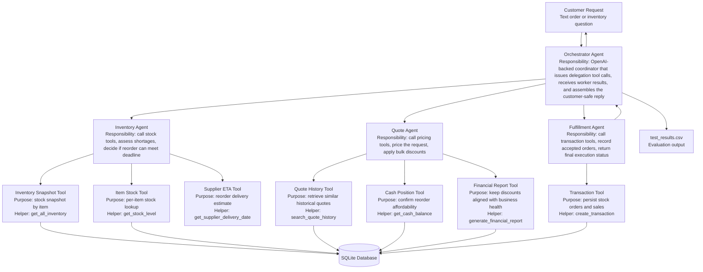

# Agent Workflow Diagram

## Flow Summary

1. The orchestrator agent is the single request entrypoint and receives the request text plus metadata such as job, event, and request date. When `UDACITY_OPENAI_API_KEY` is configured, this step is handled by the OpenAI-compatible model path described in the README.
2. On its first framework step, the orchestrator emits delegation tool calls for the inventory agent and quote agent instead of running worker logic directly in Python.
3. The inventory agent performs its own multi-step tool loop by calling inventory snapshot, stock level, supplier ETA, and cash-position tools before returning a structured inventory decision.
4. The quote agent performs its own tool loop by calling quote-history and financial-report tools before returning a structured quote decision.
5. After those worker results come back as tool returns, the orchestrator emits a fulfillment delegation tool call. The fulfillment agent then calls the transaction tool for accepted orders and returns a structured execution result.
6. The orchestrator receives the final worker outputs and converts them into a customer-facing response that includes the decision, total quote when available, delivery commitment, and a short rationale.

## Agent Boundaries

- The orchestrator is the only public entrypoint for order requests and owns the framework-level delegation sequence plus final response assembly.
- The orchestrator can run on the OpenAI-compatible endpoint from the README, while the worker agents remain tool-grounded and deterministic.
- The inventory agent owns stock, shortage, and delivery-feasibility decisions.
- The quote agent owns pricing, quote-history use, and discount logic.
- The fulfillment agent owns database-changing actions and transaction recording.